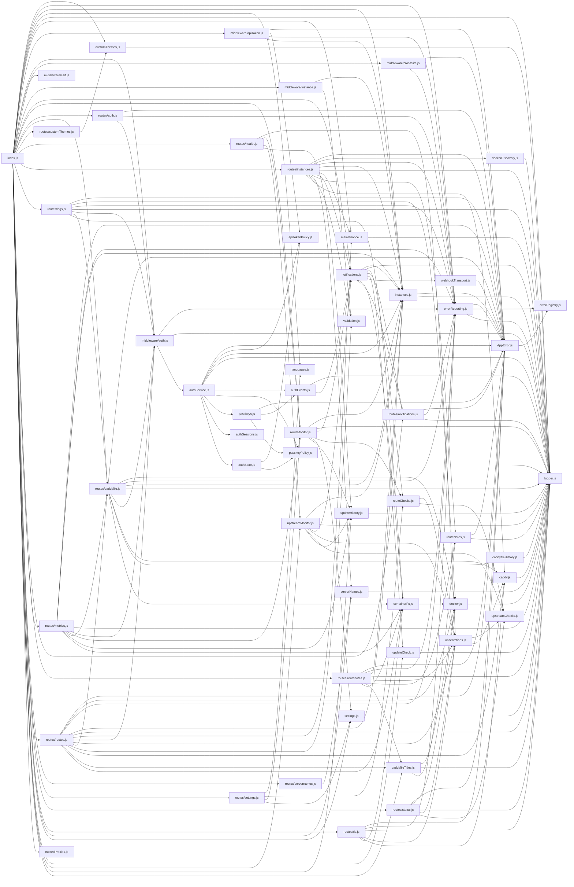

# Module dependencies

```mermaid
flowchart LR
  n0["AppError.js"]
  n1["apiTokenPolicy.js"]
  n2["authEvents.js"]
  n3["authService.js"]
  n4["authSessions.js"]
  n5["authStore.js"]
  n6["caddy.js"]
  n7["caddyfileHistory.js"]
  n8["caddyfileTitles.js"]
  n9["containerFs.js"]
  n10["customThemes.js"]
  n11["docker.js"]
  n12["dockerDiscovery.js"]
  n13["errorRegistry.js"]
  n14["errorReporting.js"]
  n15["index.js"]
  n16["instances.js"]
  n17["languages.js"]
  n18["logger.js"]
  n19["maintenance.js"]
  n20["middleware/apiToken.js"]
  n21["middleware/auth.js"]
  n22["middleware/crossSite.js"]
  n23["middleware/csrf.js"]
  n24["middleware/instance.js"]
  n25["notifications.js"]
  n26["observations.js"]
  n27["passkeyPolicy.js"]
  n28["passkeys.js"]
  n29["routeChecks.js"]
  n30["routeMonitor.js"]
  n31["routeNotes.js"]
  n32["routes/auth.js"]
  n33["routes/caddyfile.js"]
  n34["routes/customThemes.js"]
  n35["routes/health.js"]
  n36["routes/instances.js"]
  n37["routes/logs.js"]
  n38["routes/metrics.js"]
  n39["routes/notifications.js"]
  n40["routes/routenotes.js"]
  n41["routes/routes.js"]
  n42["routes/servernames.js"]
  n43["routes/settings.js"]
  n44["routes/status.js"]
  n45["routes/tls.js"]
  n46["serverNames.js"]
  n47["settings.js"]
  n48["trustedProxies.js"]
  n49["updateCheck.js"]
  n50["upstreamChecks.js"]
  n51["upstreamMonitor.js"]
  n52["uptimeHistory.js"]
  n53["validation.js"]
  n54["webhookTransport.js"]
  n0 --> n13
  n10 --> n18
  n11 --> n18
  n12 --> n18
  n14 --> n0
  n14 --> n13
  n14 --> n18
  n15 --> n10
  n15 --> n14
  n15 --> n16
  n15 --> n17
  n15 --> n18
  n15 --> n19
  n15 --> n20
  n15 --> n21
  n15 --> n22
  n15 --> n23
  n15 --> n24
  n15 --> n25
  n15 --> n30
  n15 --> n32
  n15 --> n33
  n15 --> n34
  n15 --> n35
  n15 --> n36
  n15 --> n37
  n15 --> n38
  n15 --> n39
  n15 --> n40
  n15 --> n41
  n15 --> n42
  n15 --> n43
  n15 --> n44
  n15 --> n45
  n15 --> n46
  n15 --> n47
  n15 --> n48
  n15 --> n49
  n15 --> n51
  n15 --> n52
  n15 --> n8
  n16 --> n0
  n16 --> n18
  n19 --> n18
  n2 --> n18
  n2 --> n25
  n20 --> n0
  n20 --> n1
  n20 --> n14
  n20 --> n16
  n21 --> n14
  n21 --> n18
  n21 --> n3
  n22 --> n0
  n22 --> n14
  n24 --> n16
  n24 --> n53
  n25 --> n16
  n25 --> n18
  n25 --> n29
  n25 --> n39
  n25 --> n49
  n25 --> n54
  n25 --> n9
  n26 --> n50
  n26 --> n6
  n28 --> n0
  n28 --> n2
  n28 --> n27
  n29 --> n26
  n29 --> n50
  n3 --> n0
  n3 --> n1
  n3 --> n16
  n3 --> n18
  n3 --> n2
  n3 --> n27
  n3 --> n28
  n3 --> n4
  n3 --> n5
  n30 --> n16
  n30 --> n18
  n30 --> n25
  n30 --> n29
  n30 --> n47
  n30 --> n52
  n31 --> n0
  n31 --> n18
  n32 --> n0
  n32 --> n14
  n32 --> n21
  n33 --> n0
  n33 --> n11
  n33 --> n14
  n33 --> n16
  n33 --> n18
  n33 --> n21
  n33 --> n6
  n33 --> n7
  n33 --> n9
  n34 --> n10
  n35 --> n26
  n35 --> n30
  n35 --> n51
  n35 --> n52
  n36 --> n0
  n36 --> n12
  n36 --> n14
  n36 --> n16
  n36 --> n18
  n36 --> n19
  n36 --> n25
  n36 --> n31
  n36 --> n46
  n36 --> n53
  n36 --> n6
  n37 --> n0
  n37 --> n11
  n37 --> n14
  n37 --> n18
  n37 --> n21
  n37 --> n33
  n37 --> n9
  n38 --> n0
  n38 --> n14
  n38 --> n16
  n38 --> n18
  n38 --> n21
  n38 --> n30
  n38 --> n33
  n38 --> n52
  n38 --> n9
  n39 --> n0
  n39 --> n14
  n39 --> n18
  n39 --> n25
  n40 --> n0
  n40 --> n14
  n40 --> n16
  n40 --> n18
  n40 --> n26
  n40 --> n31
  n40 --> n8
  n40 --> n9
  n41 --> n0
  n41 --> n11
  n41 --> n14
  n41 --> n16
  n41 --> n18
  n41 --> n19
  n41 --> n21
  n41 --> n26
  n41 --> n33
  n41 --> n53
  n41 --> n6
  n41 --> n8
  n41 --> n9
  n42 --> n46
  n43 --> n17
  n43 --> n29
  n43 --> n30
  n43 --> n47
  n44 --> n0
  n44 --> n11
  n44 --> n18
  n44 --> n26
  n44 --> n50
  n45 --> n0
  n45 --> n14
  n45 --> n18
  n45 --> n26
  n45 --> n6
  n45 --> n9
  n46 --> n18
  n47 --> n18
  n49 --> n18
  n5 --> n1
  n5 --> n18
  n5 --> n27
  n51 --> n16
  n51 --> n18
  n51 --> n25
  n51 --> n26
  n51 --> n50
  n51 --> n52
  n52 --> n18
  n54 --> n0
  n6 --> n18
  n7 --> n18
  n8 --> n11
  n8 --> n18
  n8 --> n31
  n9 --> n11
```
