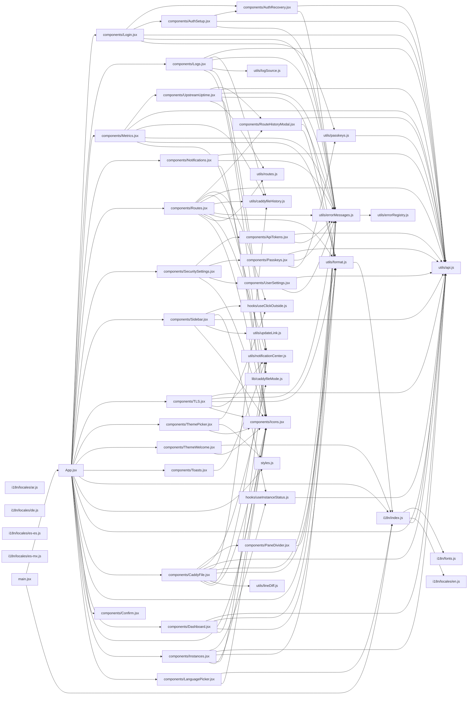

# Module dependencies

```mermaid
flowchart LR
  n0["App.jsx"]
  n1["components/ApiTokens.jsx"]
  n2["components/AuthRecovery.jsx"]
  n3["components/AuthSetup.jsx"]
  n4["components/CaddyFile.jsx"]
  n5["components/Confirm.jsx"]
  n6["components/Dashboard.jsx"]
  n7["components/Icons.jsx"]
  n8["components/Instances.jsx"]
  n9["components/LanguagePicker.jsx"]
  n10["components/Login.jsx"]
  n11["components/Logs.jsx"]
  n12["components/Metrics.jsx"]
  n13["components/Notifications.jsx"]
  n14["components/PaneDivider.jsx"]
  n15["components/Passkeys.jsx"]
  n16["components/RouteHistoryModal.jsx"]
  n17["components/Routes.jsx"]
  n18["components/SecuritySettings.jsx"]
  n19["components/Sidebar.jsx"]
  n20["components/TLS.jsx"]
  n21["components/ThemePicker.jsx"]
  n22["components/ThemeWelcome.jsx"]
  n23["components/Toasts.jsx"]
  n24["components/UpstreamUptime.jsx"]
  n25["components/UserSettings.jsx"]
  n26["hooks/useClickOutside.js"]
  n27["hooks/useInstanceStatus.js"]
  n28["i18n/fonts.js"]
  n29["i18n/index.js"]
  n30["i18n/locales/ar.js"]
  n31["i18n/locales/de.js"]
  n32["i18n/locales/en.js"]
  n33["i18n/locales/es-es.js"]
  n34["i18n/locales/es-mx.js"]
  n35["lib/caddyfileMode.js"]
  n36["main.jsx"]
  n37["styles.js"]
  n38["utils/api.js"]
  n39["utils/caddyfileHistory.js"]
  n40["utils/errorMessages.js"]
  n41["utils/errorRegistry.js"]
  n42["utils/format.js"]
  n43["utils/lineDiff.js"]
  n44["utils/logSource.js"]
  n45["utils/notificationCenter.js"]
  n46["utils/passkeys.js"]
  n47["utils/routes.js"]
  n48["utils/updateLink.js"]
  n0 --> n10
  n0 --> n11
  n0 --> n12
  n0 --> n13
  n0 --> n17
  n0 --> n18
  n0 --> n19
  n0 --> n20
  n0 --> n21
  n0 --> n22
  n0 --> n23
  n0 --> n29
  n0 --> n37
  n0 --> n38
  n0 --> n4
  n0 --> n40
  n0 --> n5
  n0 --> n6
  n0 --> n7
  n0 --> n8
  n0 --> n9
  n1 --> n38
  n1 --> n40
  n10 --> n2
  n10 --> n3
  n10 --> n38
  n10 --> n40
  n10 --> n46
  n11 --> n38
  n11 --> n39
  n11 --> n40
  n11 --> n44
  n11 --> n45
  n11 --> n7
  n12 --> n24
  n12 --> n38
  n12 --> n39
  n12 --> n40
  n12 --> n42
  n12 --> n7
  n13 --> n38
  n13 --> n40
  n13 --> n7
  n14 --> n42
  n15 --> n38
  n15 --> n40
  n15 --> n46
  n16 --> n38
  n16 --> n40
  n16 --> n42
  n17 --> n16
  n17 --> n26
  n17 --> n35
  n17 --> n38
  n17 --> n39
  n17 --> n40
  n17 --> n42
  n17 --> n45
  n17 --> n47
  n17 --> n7
  n18 --> n1
  n18 --> n15
  n18 --> n25
  n18 --> n7
  n19 --> n26
  n19 --> n27
  n19 --> n38
  n19 --> n48
  n19 --> n7
  n2 --> n38
  n2 --> n40
  n20 --> n38
  n20 --> n40
  n20 --> n42
  n20 --> n45
  n20 --> n7
  n21 --> n26
  n21 --> n37
  n21 --> n7
  n22 --> n29
  n22 --> n7
  n23 --> n45
  n24 --> n16
  n24 --> n38
  n24 --> n40
  n24 --> n42
  n24 --> n45
  n24 --> n47
  n25 --> n38
  n25 --> n40
  n27 --> n38
  n29 --> n28
  n29 --> n32
  n29 --> n38
  n3 --> n2
  n3 --> n38
  n3 --> n40
  n36 --> n0
  n36 --> n29
  n4 --> n14
  n4 --> n35
  n4 --> n38
  n4 --> n39
  n4 --> n40
  n4 --> n42
  n4 --> n43
  n4 --> n45
  n4 --> n7
  n40 --> n41
  n42 --> n29
  n46 --> n38
  n6 --> n38
  n6 --> n40
  n6 --> n42
  n6 --> n7
  n8 --> n27
  n8 --> n38
  n8 --> n40
  n8 --> n45
  n8 --> n7
  n9 --> n29
  n9 --> n7
```
